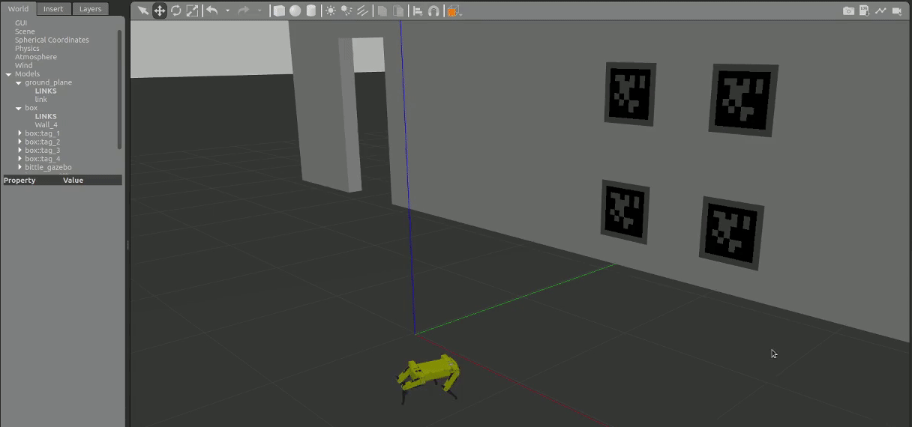

# Robust Fiducial Markers Detection And Following Using Quadruped Robot (ROS)

 
 
 

# Project Structure

This ROS Environment consists of 4 packages:
- ## 1- bittle_description: 
This package includes bittle urdf model
 

- ## 2- bittle_gazebo :
This package used for spawning bittle robot
 

- ## 3- apriltag_pose_estimation:
This package is used to estimate and publish the current distance between camera and Apriltag
 

- ## 4- apriltag_follower: 
the main package in which Apriltag detection process is implemented
 

 Bittle Model             |   Apriltags
:-------------------------:|:-------------------------:
  |  

# Getting Started

# 1- Simulation (simulation) ##

> **_NOTE:_**  
1- This Robot model urdf is cloned from this repo, [Bittle_URDF](https://github.com/AIWintermuteAI/Bittle_URDF)   2- while the JointEffortService and the mixer implemenation has been cloned from this repo  [notspot_sim_py](https://github.com/lnotspotl/notspot_sim_py)

1. Clone this project. 
    - 
    ~~~bash
    $ cd construction-robotics-ws-2022_23/simulation
    ~~~
2. Building code in a catkin workspace and adding the packages to current running local ros. 
    - 
    ~~~bash
    $ catkin_make
    ~~~
    ~~~bash
    $ source devel/setup.bash
    ~~~
3. Open the simulation environment.
    - 
    ~~~bash
    $ roslaunch bittle_gazebo simulation.launch
    ~~~
4. Spawn Bittle Model (in new terminal).
    - 
    ~~~bash
    $ source devel/setup.bash
    ~~~
    ~~~bash
    $ roslaunch bittle_gazebo spawn_robot.launch
    ~~~
5. Estimate the camera distance to the apriltag (in new terminal).
    -
    ~~~bash
    $ source devel/setup.bash
    ~~~
    ~~~bash
    $ roslaunch apriltag_pose_estimation apriltag_detector.launch
    ~~~
6. Follow apriltag (in new terminal).
    - 
    ~~~bash
    $ source devel/setup.bash
    ~~~
    ~~~bash
    $ roslaunch apriltag_follower apriltag_follower.launch
    ~~~

 :star: :star: :star:  

